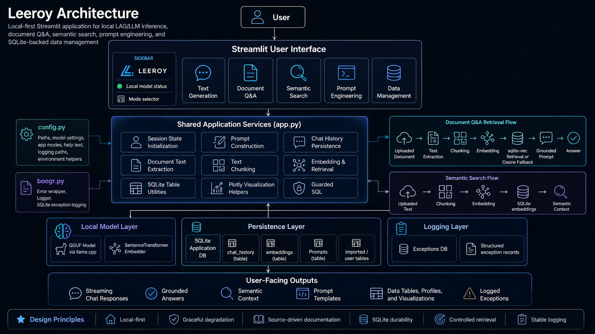

___

# Leeroy Architecture

Leeroy is a local-first Streamlit application that combines local language-model inference, document
retrieval, semantic search, prompt-template management, SQLite-backed data tools, and structured
exception logging.

The architecture is intentionally practical: one main application module coordinates the user
interface and workflows, a configuration module centralizes runtime settings, and a logging module
provides reusable exception capture and SQLite persistence.

## 🧭 Purpose

This page explains how Leeroy is organized, how data moves through the application, and how the main
source files support the user-facing workflows.

Leeroy is designed around five primary application modes:

| Mode               | Purpose                                                                                            |
| ------------------ | -------------------------------------------------------------------------------------------------- |
| Text Generation    | Chat with the configured local model using Streamlit chat controls and shared prompt construction. |
| Document Q&A       | Upload documents, retrieve relevant excerpts, and generate grounded answers.                       |
| Semantic Search    | Build a local semantic index from uploaded text and use it as prompt context.                      |
| Prompt Engineering | Manage reusable prompt templates stored in SQLite.                                                 |
| Data Management    | Import, inspect, profile, filter, aggregate, visualize, administer, and query SQLite tables.       |

## 🧱 System Overview

Leeroy uses a layered local application architecture.

```text

┌─────────────────────────────────────────────────────────────────────┐
│                              User                                   │
└───────────────────────────────┬─────────────────────────────────────┘
                                │
                                ▼
┌─────────────────────────────────────────────────────────────────────┐
│                      Streamlit User Interface                       │
│                                                                     │
│  Sidebar                                                            │
│  ├── Logo                                                           │
│  ├── Local model status                                             │
│  └── Application mode selector                                      │
│                                                                     │
│  Main Mode Views                                                    │
│  ├── Text Generation                                                │
│  ├── Document Q&A                                                   │
│  ├── Semantic Search                                                │
│  ├── Prompt Engineering                                             │
│  └── Data Management                                                │
└───────────────────────────────┬─────────────────────────────────────┘
                                │
                                ▼
┌─────────────────────────────────────────────────────────────────────┐
│                    Shared Application Services                      │
│                                                                     │
│  ├── Session-state initialization                                   │
│  ├── Prompt construction                                            │
│  ├── Chat-history persistence                                       │
│  ├── Document text extraction                                       │
│  ├── Text chunking                                                  │
│  ├── Embedding and retrieval                                        │
│  ├── SQLite table utilities                                         │
│  ├── Plotly visualization helpers                                   │
│  └── Structured exception logging                                   │
└───────────────┬───────────────────────┬─────────────────────────────┘
                │                       │
                ▼                       ▼
┌─────────────────────────────┐   ┌───────────────────────────────────┐
│       Local Model Layer     │   │        Persistence Layer          │
│                             │   │                                   │
│  llama.cpp / GGUF model     │   │  SQLite application database      │
│  SentenceTransformer model  │   │  SQLite exception log database    │
└─────────────────────────────┘   └───────────────────────────────────┘

```

## 🧩 Source Module Responsibilities

| Module             | Responsibility                                                                                                                                                                                                              |
| ------------------ | --------------------------------------------------------------------------------------------------------------------------------------------------------------------------------------------------------------------------- |
| `app.py`           | Main Streamlit application. Defines UI layout, mode routing, local LLM helpers, prompt building, document retrieval, semantic indexing, prompt administration, SQLite data-management helpers, and visualization utilities. |
| `config.py`        | Central runtime configuration. Defines paths, model settings, logging paths, UI constants, help text, app modes, environment helper functions, and validation helper `throw_if()`.                                          |
| `boogr.py`         | Exception and logging support. Defines `Error` for wrapped exception metadata and `Logger` for SQLite-backed diagnostic persistence.                                                                                        |
| `requirements.txt` | Runtime and documentation dependencies, including Streamlit, pandas, sentence-transformers, PyMuPDF, sqlite-vec, MkDocs, and mkdocstrings.                                                                                  |
| `README.md`        | Repository-facing overview, installation notes, local model description, and application summary.                                                                                                                           |

## 🖥️ Streamlit Interface Layer

The Streamlit interface is the user-facing entry point. It is organized around a sidebar mode
selector and mode-specific main content blocks.

### Sidebar Responsibilities

The sidebar provides:

| Component          | Purpose                                                                                                    |
| ------------------ | ---------------------------------------------------------------------------------------------------------- |
| Logo               | Displays the Leeroy project identity.                                                                      |
| Local model status | Indicates whether the configured local GGUF file is available.                                             |
| Mode selector      | Routes the user to Text Generation, Document Q&A, Semantic Search, Prompt Engineering, or Data Management. |

### Main View Responsibilities

Each mode renders its own controls and workflows.

| View               | Main Responsibilities                                                                                                            |
| ------------------ | -------------------------------------------------------------------------------------------------------------------------------- |
| Text Generation    | Chat UI, system instructions, response controls, probability controls, context controls, streaming output, and chat persistence. |
| Document Q&A       | Document loading, preview, active document state, retrieval prompt construction, and grounded chat output.                       |
| Semantic Search    | Upload files, chunk text, embed chunks, and store vectors in SQLite.                                                             |
| Prompt Engineering | Browse, search, sort, page, select, create, edit, update, and delete prompt records.                                             |
| Data Management    | Work with SQLite tables through import, browse, CRUD, explore, filter, aggregate, visualize, admin, and SQL workflows.           |

## 🧠 Local Model Layer

Leeroy supports optional local LLM execution through a configured GGUF model path.

```text
Configuration
  │
  ├── ENABLE_LOCAL_LLM
  ├── MODEL_PATH
  ├── DEFAULT_CTX
  └── CORES
  │
  ▼
Model Availability Check
  │
  ▼
Cached llama.cpp Loader
  │
  ▼
Shared LLM Turn Execution
  │
  ▼
Streamlit Chat Output
```

The local model layer is intentionally defensive. If local LLM support is disabled or the configured
GGUF file does not exist, the application can still load the interface and display a clear
model-unavailable message.

## 🧾 Prompt Construction Layer

Prompt construction is shared across Text Generation and Document Q&A.

The prompt builder can include:

| Prompt Component       | Source                                                   |
| ---------------------- | -------------------------------------------------------- |
| System instructions    | Streamlit session state or prompt template cascade.      |
| Semantic context       | Retrieved chunks from stored embeddings.                 |
| Basic document context | Session-state document snippets.                         |
| Chat history           | SQLite-backed message history and current session state. |
| User input             | Current user prompt or document-grounded question.       |

Prompt construction follows this general flow:

```text
User Input
  │
  ├── Read System Instructions
  ├── Read Semantic Toggle
  ├── Read Basic Context
  ├── Read Chat History
  └── Retrieve Optional Semantic Chunks
  │
  ▼
Assemble Prompt
  │
  ▼
Send to Local Model
  │
  ▼
Return Assistant Response
```

## 📚 Document Q&A Architecture

Document Q&A mode uses a retrieval-augmented generation pattern.

```text
Uploaded File
  │
  ▼
Document Bytes Stored in Session State
  │
  ▼
Text Extraction
  │
  ▼
Chunking
  │
  ▼
Embedding
  │
  ├── sqlite-vec virtual table when available
  └── In-memory cosine fallback when sqlite-vec is unavailable
  │
  ▼
Top-k Relevant Chunks
  │
  ▼
Grounded Document Prompt
  │
  ▼
Local Model Answer
```

### Document Session State

| Session Key            | Purpose                                                           |
| ---------------------- | ----------------------------------------------------------------- |
| `uploaded`             | Stores uploaded Streamlit file objects.                           |
| `active_docs`          | Stores active document names.                                     |
| `doc_bytes`            | Maps document names to raw file bytes.                            |
| `doc_source`           | Tracks the selected document source.                              |
| `docqna_vec_ready`     | Indicates whether sqlite-vec retrieval is active.                 |
| `docqna_fingerprint`   | Tracks document/index freshness.                                  |
| `docqna_chunk_count`   | Stores the number of indexed chunks.                              |
| `docqna_fallback_rows` | Stores fallback chunk/vector rows when sqlite-vec is unavailable. |

### Retrieval Strategy

Leeroy uses a two-path retrieval strategy:

| Path                 | Description                                                                                                               |
| -------------------- | ------------------------------------------------------------------------------------------------------------------------- |
| sqlite-vec path      | Preferred path. Stores document vectors in a SQLite virtual vector table and retrieves nearest chunks by vector distance. |
| Cosine fallback path | Backup path. Stores chunk vectors in memory/session state and ranks chunks by cosine similarity.                          |

This makes the Document Q&A workflow resilient across environments where sqlite-vec may or may not
be available.

## 🔍 Semantic Search Architecture

Semantic Search mode creates a reusable local semantic index.

```text
Uploaded Text Files
  │
  ▼
Decode Text
  │
  ▼
Chunk Text
  │
  ▼
Encode Chunks with SentenceTransformer
  │
  ▼
Store Chunk and Vector Blob in SQLite
  │
  ▼
Use Similar Chunks in Prompt Builder
```

The semantic index is stored in the SQLite `embeddings` table.

| Column   | Purpose                              |
| -------- | ------------------------------------ |
| `id`     | Row identifier.                      |
| `chunk`  | Text chunk used as semantic context. |
| `vector` | Embedding vector stored as bytes.    |

When semantic context is enabled, the prompt builder can retrieve similar chunks and add them to the
model context.

## 📝 Prompt Engineering Architecture

Prompt Engineering mode provides a local prompt-template management interface backed by SQLite.

```text

Prompt Table
  │
  ├── Search
  ├── Sort
  ├── Page
  ├── Select
  ├── Edit
  ├── Create
  ├── Update
  └── Delete
  │
  ▼
Reusable Prompt Templates
  │
  ▼
System Instructions

```

Prompt records use the `Prompts` table.

| Field       | Purpose                                       |
| ----------- | --------------------------------------------- |
| `PromptsId` | Primary key.                                  |
| `Caption`   | Display label used by template selectors.     |
| `Name`      | Prompt name.                                  |
| `Text`      | Prompt body.                                  |
| `Version`   | Prompt version.                               |
| `ID`        | Optional external or user-defined identifier. |

Prompt templates support repeatable workflows by allowing users to store standard instructions,
analytical formats, or drafting constraints and reuse them across sessions.

## 🗄️ Persistence Architecture

Leeroy uses SQLite as its persistence backbone.

```text
SQLite Persistence
  │
  ├── Application Database
  │   ├── chat_history
  │   ├── embeddings
  │   ├── Prompts
  │   └── imported/user-created tables
  │
  └── Logging Database
      └── Exceptions
```

### Application Database

The application database stores operational data.

| Table                | Purpose                                           |
| -------------------- | ------------------------------------------------- |
| `chat_history`       | Persists user and assistant chat messages.        |
| `embeddings`         | Stores semantic-search chunks and vector bytes.   |
| `Prompts`            | Stores reusable prompt templates.                 |
| User/imported tables | Stores tabular data used by Data Management mode. |

### Logging Database

The logging database stores structured exception records.

| Field     | Purpose                                                 |
| --------- | ------------------------------------------------------- |
| `created` | Exception record timestamp.                             |
| `cause`   | Logical component or class associated with the failure. |
| `module`  | Source module where the failure occurred.               |
| `method`  | Stable function or method signature.                    |
| `message` | Original exception message.                             |
| `info`    | Combined exception type and traceback information.      |
| `trace`   | Formatted traceback text.                               |

## 🧮 Data Management Architecture

Data Management mode provides a practical SQLite administration and analysis layer.

```text
SQLite Tables
  │
  ├── List Tables
  ├── Inspect Schema
  ├── Read Rows
  ├── Import Data
  ├── Create Tables
  ├── Add / Rename / Drop Columns
  ├── Create Indexes
  ├── Profile Tables
  ├── Filter Rows
  ├── Aggregate Values
  ├── Visualize Data
  └── Run Guarded SQL
```

### Data Utility Groups

| Group           | Utilities                                                                                                                       |
| --------------- | ------------------------------------------------------------------------------------------------------------------------------- |
| Connection      | `create_connection()`                                                                                                           |
| Table discovery | `list_tables()`, `create_schema()`, `get_indexes()`                                                                             |
| Table reading   | `read_table()`                                                                                                                  |
| Schema actions  | `create_custom_table()`, `add_column()`, `rename_column()`, `rename_table()`, `drop_column()`, `drop_table()`, `create_index()` |
| Data import     | `convert_dataframe()`, `insert_data()`, `get_sqlite_type()`                                                                     |
| Profiling       | `create_profile_table()`                                                                                                        |
| Analysis        | `apply_filters()`, `create_aggregation()`, `create_visualization()`                                                             |
| SQL safety      | `is_safe_query()`, `create_identifier()`                                                                                        |

### Guarded SQL

The SQL safety layer allows read-oriented queries while blocking destructive operations.

Allowed patterns include:

```text
SELECT
WITH
EXPLAIN
PRAGMA
```

Blocked operations include:

```text
INSERT
UPDATE
DELETE
DROP
ALTER
CREATE
ATTACH
DETACH
VACUUM
REPLACE
TRIGGER
```

## 🧯 Error Handling and Logging Architecture

Leeroy uses a structured exception wrapper and SQLite-backed logger.

```text
Exception Occurs
  │
  ▼
Wrap with Error
  │
  ├── Original exception
  ├── Module
  ├── Cause
  ├── Stable method signature
  ├── Traceback
  └── Diagnostic info
  │
  ▼
Logger.write()
  │
  ▼
SQLite Exceptions Table
```

Standard pattern:

```python
except Exception as e:
    exception = Error( e )
    exception.module = 'app'
    exception.cause = 'database'
    exception.method = 'function_name( arg: type ) -> return_type'
    Logger( ).write( exception )
    raise exception
```

Fallback-safe pattern:

```python
except Exception as e:
    exception = Error( e )
    exception.module = 'app'
    exception.cause = 'runtime'
    exception.method = 'helper_name( ) -> bool'
    Logger( ).write( exception )
    return False
```

The method string is a stable signature. It should not contain user input, document text, dataframe
contents, file paths, prompts, tokens, secrets, SQL text, or object memory addresses.

## 📦 Dependency Architecture

Leeroy combines runtime, data, retrieval, visualization, and documentation dependencies.

| Dependency Area       | Packages                                                                                     |
| --------------------- | -------------------------------------------------------------------------------------------- |
| UI                    | `streamlit`                                                                                  |
| Data                  | `pandas`, `numpy`, `pydantic`, `typing_extensions`                                           |
| PDF/document handling | `PyMuPDF`                                                                                    |
| Retrieval             | `sentence-transformers`, `sqlite-vec`                                                        |
| Visualization         | `plotly-express`                                                                             |
| Local model support   | `llama-cpp-python` when installed/configured                                                 |
| Documentation         | `mkdocs`, `mkdocs-material`, `mkdocstrings[python]`, `mkdocs-autorefs`, `pymdown-extensions` |

## 🧱 MkDocs Documentation Architecture

The documentation site is generated from Markdown pages and source docstrings.

```text
docs/
  │
  ├── index.md
  ├── architecture.md
  ├── development.md
  │
  ├── user-guide/
  │   ├── index.md
  │   ├── text-generation.md
  │   ├── document-qna.md
  │   ├── semantic-search.md
  │   ├── prompt-engineering.md
  │   └── data-management.md
  │
  ├── api/
  │   ├── index.md
  │   ├── app.md
  │   ├── config.md
  │   └── boogr.md
  │
  └── assets/
      ├── css/leeroy.css
      └── js/leeroy.js
```

The API reference uses mkdocstrings pages such as:

```markdown
# App

::: app
```

This keeps the API documentation source-driven and reduces duplication between Markdown and Python
docstrings.

## ✅ Design Principles

Leeroy follows several practical design principles.

| Principle                   | Meaning                                                                                        |
| --------------------------- | ---------------------------------------------------------------------------------------------- |
| Local-first operation       | Core workflows use local files, local databases, and optional local models.                    |
| Graceful degradation        | The UI can load even when optional model or vector features are unavailable.                   |
| Source-driven documentation | API documentation is generated from Google-style source docstrings.                            |
| SQLite durability           | Chat history, prompts, embeddings, tabular data, and logs use local SQLite stores.             |
| Controlled retrieval        | Document Q&A retrieves relevant chunks instead of blindly stuffing full documents.             |
| Stable logging              | Exception records use stable metadata and avoid user content in method signatures.             |
| Preserve behavior           | Documentation and logging improvements should not alter Streamlit layout or runtime workflows. |

## 🔗 Related Pages

| Page                                                   | Purpose                                                   |
| ------------------------------------------------------ | --------------------------------------------------------- |
| [Home](index.md)                                       | Project overview and quick start.                         |
| [User Guide](user-guide/index.md)                      | Task-oriented usage instructions.                         |
| [Text Generation](user-guide/text-generation.md)       | Chat and local model workflow.                            |
| [Document Q&A](user-guide/document-qna.md)             | Retrieval-augmented document workflow.                    |
| [Semantic Search](user-guide/semantic-search.md)       | Local semantic indexing workflow.                         |
| [Prompt Engineering](user-guide/prompt-engineering.md) | Prompt-template management workflow.                      |
| [Data Management](user-guide/data-management.md)       | SQLite administration and analytical tooling.             |
| [API Reference](api/index.md)                          | Source-generated API documentation.                       |
| [Development](development.md)                          | Validation, documentation build, and deployment workflow. |
