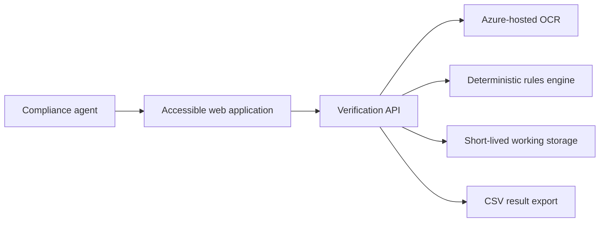
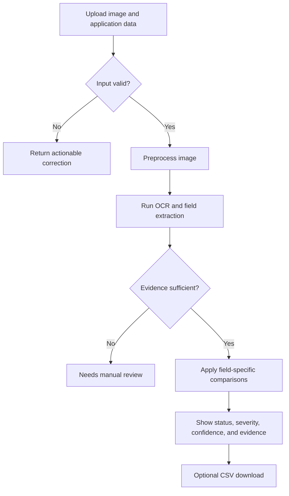
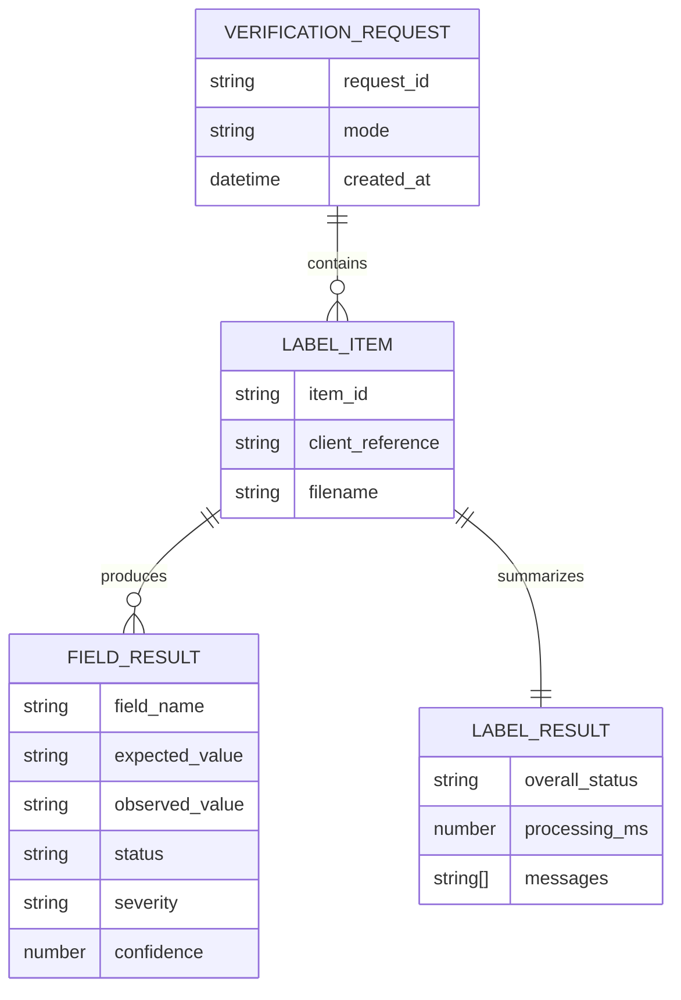

# 🏗️ System Architecture

## 📋 Document Status

This document defines the proposed architecture for the AI-Powered Alcohol Label Verification prototype. It is based on the stakeholder interview notes, derived requirements, and technical constraints supplied with the project. Where the source repository has not established a specific technology or component, this document identifies a recommended design rather than representing it as implemented behavior.

## 🎯 Architectural Goals

The system is designed to:

* Extract required alcohol-label fields from uploaded images.
* Compare extracted label values with application data.
* distinguish acceptable textual variation from material mismatches.
* Apply strict validation to the government health warning.
* Return a result in less than five seconds per label under normal prototype conditions.
* Support single-label and small-to-medium batch processing.
* Operate entirely within an Azure-controlled boundary.
* Avoid direct integration with the Certificate of Label Approval (COLA) system.
* Avoid long-term storage of uploaded images or extracted label data.
* Remain usable by compliance agents with widely varying technical experience.

## 🧭 System Context

```mermaid
flowchart LR
    Agent["Compliance agent"] --> UI["Accessible web application"]
    UI --> API["Verification API"]
    API --> OCR["Azure-hosted OCR"]
    API --> Rules["Deterministic rules engine"]
    API --> Temp["Short-lived working storage"]
    API --> Export["CSV result export"]
```

The prototype is a standalone decision-support tool. The agent supplies application values and one or more label images. The system extracts visible fields, compares them, and presents evidence-supported findings. The compliance agent remains the final decision-maker.

## 🧱 Logical Components

| Component | Responsibility | Key constraints |
|---|---|---|
| Web interface | Collect application data and label images; present results and exports | One-screen workflow, large controls, keyboard navigation, high contrast |
| Request validator | Validate file type, file size, batch size, and required application fields | Reject invalid input before OCR work begins |
| Image preprocessor | Normalize orientation, contrast, scale, and perspective where practical | Preserve the original image for evidence display; do not conceal low quality |
| OCR adapter | Extract text, words, lines, coordinates, and confidence values | Azure-hosted or approved containerized OCR only |
| Field extractor | Map OCR output to normalized label fields | Retain original text and source regions for traceability |
| Rules engine | Compare application and label fields using field-specific policies | Exact warning validation; configurable fuzzy thresholds elsewhere |
| Result aggregator | Calculate field status, severity, confidence, and overall disposition | Never convert uncertain evidence into an automatic pass |
| Batch coordinator | Process multiple independent labels and track progress | Prototype target: 20–50 images; stakeholder scenario may reach 200–300 later |
| Export service | Produce a CSV summary without embedding image data | Escape spreadsheet formula characters and preserve stable columns |
| Telemetry service | Record duration, outcome counts, and technical failures | Exclude label text, images, addresses, and other sensitive content |

## 🔄 Verification Workflow

```mermaid
flowchart TD
    Upload["Upload image and application data"] --> Validate{"Input valid?"}
    Validate -- No --> InputError["Return actionable correction"]
    Validate -- Yes --> Prepare["Preprocess image"]
    Prepare --> Extract["Run OCR and field extraction"]
    Extract --> Quality{"Evidence sufficient?"}
    Quality -- No --> Manual["Needs manual review"]
    Quality -- Yes --> Compare["Apply field-specific comparisons"]
    Compare --> Report["Show status, severity, confidence, and evidence"]
    Report --> Export["Optional CSV download"]
```

### Processing stages

1. Validate the request before allocating OCR resources.
2. Assign a request identifier that contains no business data.
3. Correct image orientation and improve readability without altering semantic content.
4. Run OCR and retain text spans, confidence scores, and bounding regions.
5. Extract each supported field into a canonical result structure.
6. Apply the comparison policy appropriate to that field.
7. Aggregate field findings without allowing a high-confidence match to hide a critical failure.
8. Return results to the user and dispose of temporary content according to the retention policy.

## 🧠 Field Extraction and Comparison

The extraction layer should return both the visible text and a normalized comparison value. Normalization is field-specific and must never replace the evidence shown to the user.

| Field | Extraction strategy | Comparison policy | Typical severity |
|---|---|---|---|
| Brand name | Text plus layout prominence | Case-, punctuation-, whitespace-, and possessive-tolerant comparison | Minor or major depending on similarity |
| Class/type | Controlled terms plus text extraction | Canonical term mapping followed by similarity comparison | Major |
| Alcohol content | Numeric value, unit, and proof relationship | Numeric comparison with explicit unit handling | Critical when materially inconsistent |
| Net contents | Numeric value and unit | Convert compatible units before comparison | Major |
| Producer/bottler | Named entity plus adjacent address | Token-aware name and structured-address comparison | Major |
| Country of origin | Country entity and origin phrases | Canonical country-name comparison | Major for imports |
| Government warning | Exact text, heading style, placement evidence | Exact statutory text and formatting checks | Critical |

### Government warning validation

The warning rule must be deterministic and independently testable. TTB states that the warning applies to alcohol beverages containing at least 0.5 percent alcohol by volume, must be separate from other information, and must use `GOVERNMENT WARNING` in capital letters and bold type. The remainder must form a continuous statement. See [27 CFR part 16 guidance from TTB](https://www.ttb.gov/regulated-commodities/beverage-alcohol/distilled-spirits/ds-labeling-home/ds-health-warning).

The validator should evaluate:

* Presence of the complete prescribed statement.
* Exact word sequence, punctuation, and paragraph continuity.
* Uppercase `GOVERNMENT WARNING` heading.
* Bold presentation of the heading, when style evidence is available.
* Separation from unrelated label content.
* Contrast and legibility indicators.
* Minimum type-size rules when image scale or container size provides sufficient evidence.

If OCR or image geometry cannot establish a formatting requirement reliably, the result must be `manual_review`, not `pass`.

## 🗃️ Canonical Data Model

```mermaid
erDiagram
    VERIFICATION_REQUEST ||--o{ LABEL_ITEM : contains
    LABEL_ITEM ||--o{ FIELD_RESULT : produces
    LABEL_ITEM ||--|| LABEL_RESULT : summarizes

    VERIFICATION_REQUEST {
        string request_id
        string mode
        datetime created_at
    }
    LABEL_ITEM {
        string item_id
        string client_reference
        string filename
    }
    FIELD_RESULT {
        string field_name
        string expected_value
        string observed_value
        string status
        string severity
        number confidence
    }
    LABEL_RESULT {
        string overall_status
        number processing_ms
        string[] messages
    }
```

Allowed field statuses are `pass`, `fail`, `manual_review`, `not_found`, and `not_applicable`. Allowed severities are `info`, `minor`, `major`, and `critical`. Confidence describes extraction certainty; it is not a probability that the label is legally compliant.

## ☁️ Azure Deployment Model

The recommended prototype deployment uses an Azure App Service or Azure Container Apps front end/API with an Azure-hosted OCR service. Azure Document Intelligence can return structured text, key-value pairs, and tables; its container option may be useful where workload locality or tighter network isolation is required. See [Azure Document Intelligence](https://learn.microsoft.com/en-us/azure/ai-services/document-intelligence/faq?view=doc-intel-4.0.0) and [container configuration](https://learn.microsoft.com/en-us/azure/ai-services/document-intelligence/containers/configuration?view=doc-intel-4.0.0).

Recommended controls include:

* Microsoft Entra ID authentication when the prototype moves beyond anonymous evaluation.
* Managed identities instead of embedded service credentials.
* Private endpoints and VNet integration where the selected Azure services support them.
* Azure Key Vault for secrets that cannot be replaced by managed identity.
* HTTPS-only transport and encryption at rest for unavoidable temporary storage.
* Same-region deployment to reduce latency and avoid unnecessary data movement.
* Application Insights telemetry with content logging disabled.

The prototype must not call unapproved public ML endpoints. Network dependencies should be enumerated before deployment and tested from the target agency network.

## 🔒 Security and Data Lifecycle

1. Accept only documented image and archive formats.
2. Validate content signatures rather than trusting filename extensions.
3. Enforce per-file, request, decompressed-size, and batch-count limits.
4. Reject archive path traversal, nested archives, and encrypted archives.
5. Process uploaded content in an isolated temporary location.
6. Do not write label images or extracted text to application logs.
7. Delete temporary artifacts after the response or a short failure-recovery window.
8. Return opaque identifiers rather than storage paths.
9. Record only operational metrics necessary to evaluate reliability and performance.
10. Document any production retention schedule before handling real applications.

## ⚡ Performance and Scaling

The primary service-level objective is less than five seconds per ordinary label. Measure the 50th, 95th, and 99th percentile durations separately for preprocessing, OCR, extraction, comparison, and response rendering.

For batch requests, use bounded parallelism rather than launching every image simultaneously. The API should report per-item progress and isolate failures so one unreadable label does not fail the complete batch. The initial prototype should validate 20–50 image batches. Processing 200–300 applications is a future scale target that warrants an asynchronous queue, worker autoscaling, idempotent jobs, and durable status storage.

## ♿ Accessibility and Usability

The interface should meet WCAG 2.1 AA as a baseline and should provide:

* A single obvious primary action.
* Visible keyboard focus and logical tab order.
* Text labels in addition to color-coded status.
* High-contrast presentation and scalable text.
* Progress text that assistive technology can announce.
* Plain-language error recovery steps.
* Evidence beside each mismatch so the agent does not need to hunt through the image.

## 🚨 Failure Handling

| Condition | Required behavior |
|---|---|
| Unsupported or corrupt file | Reject before processing and identify accepted formats |
| Low OCR confidence | Return extracted evidence with `manual_review` status |
| Missing field | Return `not_found`; never substitute an inferred value silently |
| OCR dependency timeout | Return a retryable service error with request ID |
| One batch item fails | Preserve successful item results and report the failed item separately |
| Performance threshold exceeded | Complete safely, record timing telemetry, and warn without concealing results |
| Warning style cannot be established | Require manual review even when the text matches |

## ✅ Architectural Acceptance Criteria

The architecture is acceptable when:

* Every required field has an extraction and comparison policy.
* Government-warning validation is deterministic and covered by unit tests.
* All uncertain findings are routed to manual review.
* No image or extracted text remains after the documented temporary-retention window.
* No required runtime call leaves the approved Azure boundary.
* Single-label performance is measured and meets the five-second target under the documented test profile.
* Batch failures are isolated per item.
* The interface remains usable by keyboard and does not rely on color alone.

## 🔗 Related Documentation

* [Documentation Home](index.md)
* [User Guide](user-guide/index.md)
* [API Reference](api/index.md)
* [Development Guide](development.md)

